# 一石四鳥モバイルシステム

物流担当者・店舗スタッフ・顧客・企業が全員メリットを得られるAWSベースの在庫管理システム。

---

## UI紹介

<table>
  <tr>
    <th colspan="3" align="center" style="font-size: 1.2em;">トップページ</th>
  </tr>
  <tr>
    <td colspan="3" align="center">
      <b>トップ画面</b><br>
      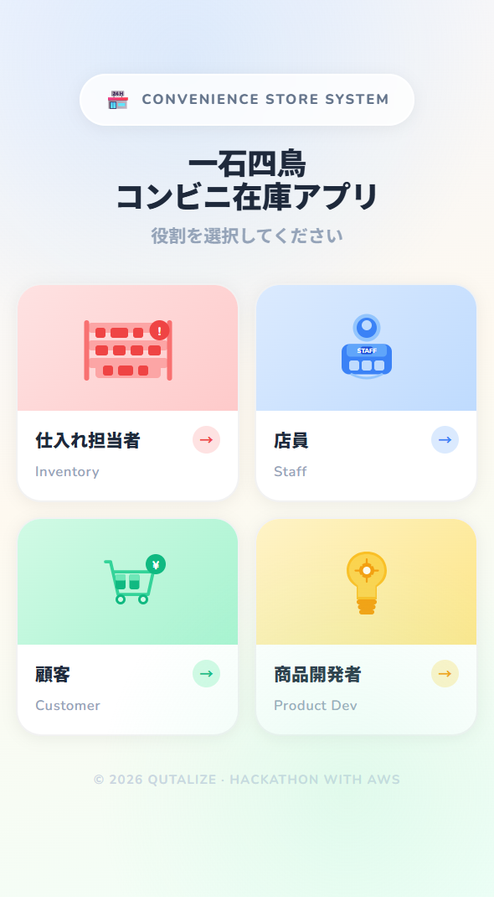
    </td>
  </tr>

  <tr>
    <th colspan="3" align="center" style="font-size: 1.2em;">機能① SNSバズ検知・仕入れ増加予測通知</th>
  </tr>
  <tr>
    <td align="center">
      <b>通知用メール登録画面</b><br>
      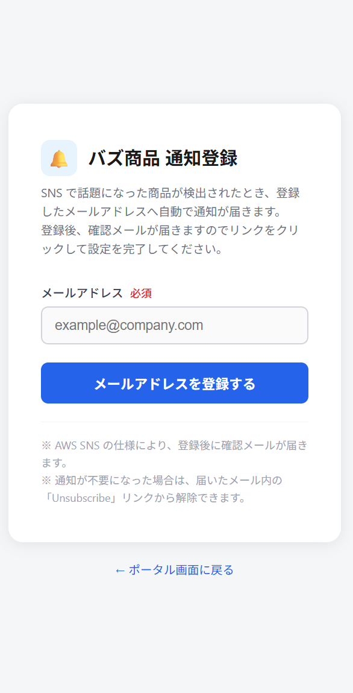
    </td>
    <td align="center">
      <b>登録完了メール</b><br>
      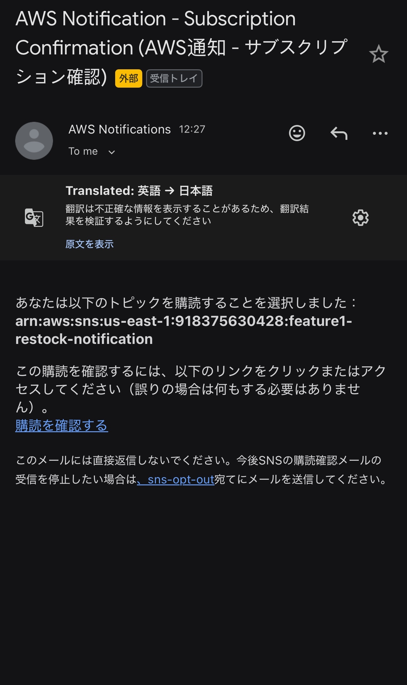
    </td>
    <td align="center">
      <b>仕入れ増加量予測通知メール</b><br>
      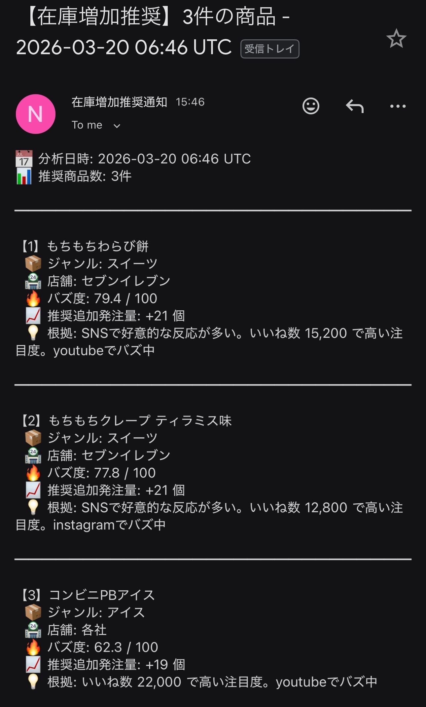
    </td>
  </tr>

  <tr>
    <th colspan="3" align="center" style="font-size: 1.2em;">機能② 店舗在庫管理・割引商品検索</th>
  </tr>
  <tr>
    <td align="center">
      <b>画像アップロード画面</b><br>
      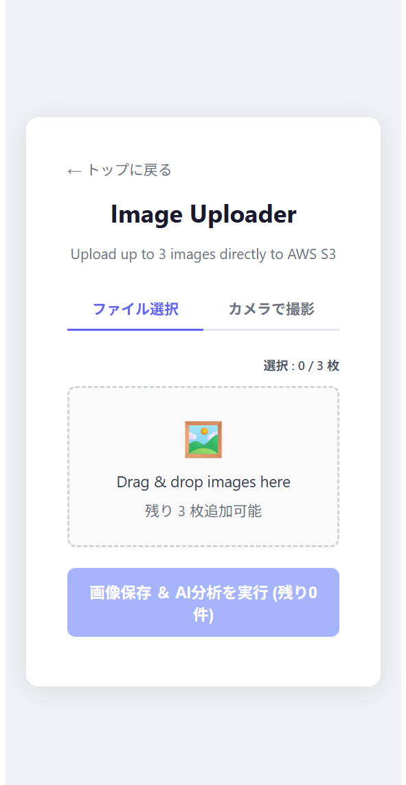
    </td>
    <td align="center">
      <b>画像投稿の様子</b><br>
      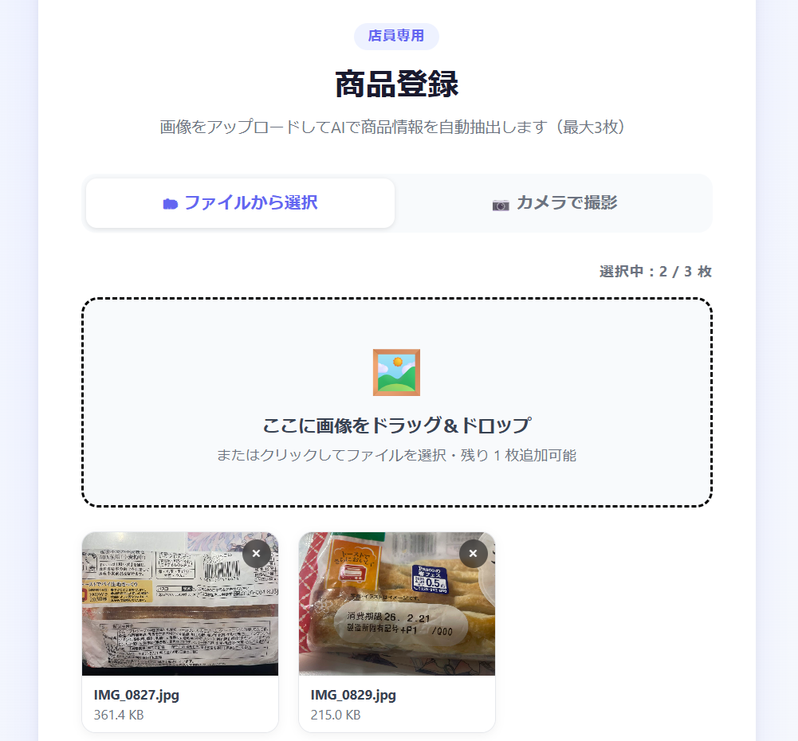
    </td>
    <td align="center">
      <b>分析・判定の様子</b><br>
      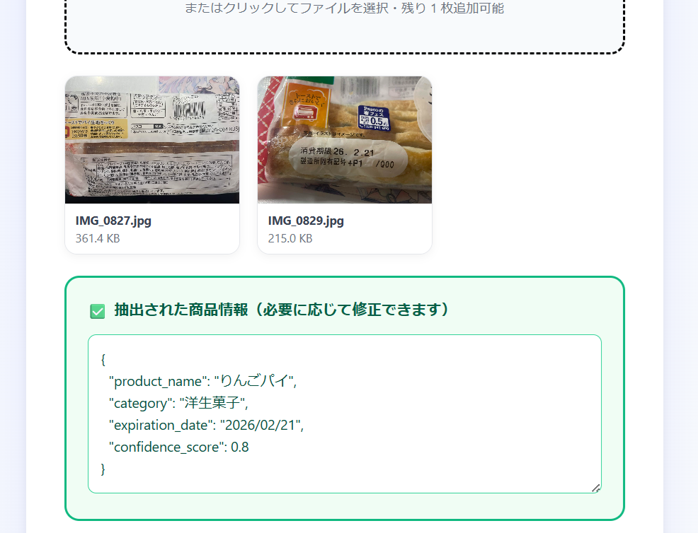
    </td>
    <td align="center">
      <b>近隣店舗検索</b><br>
      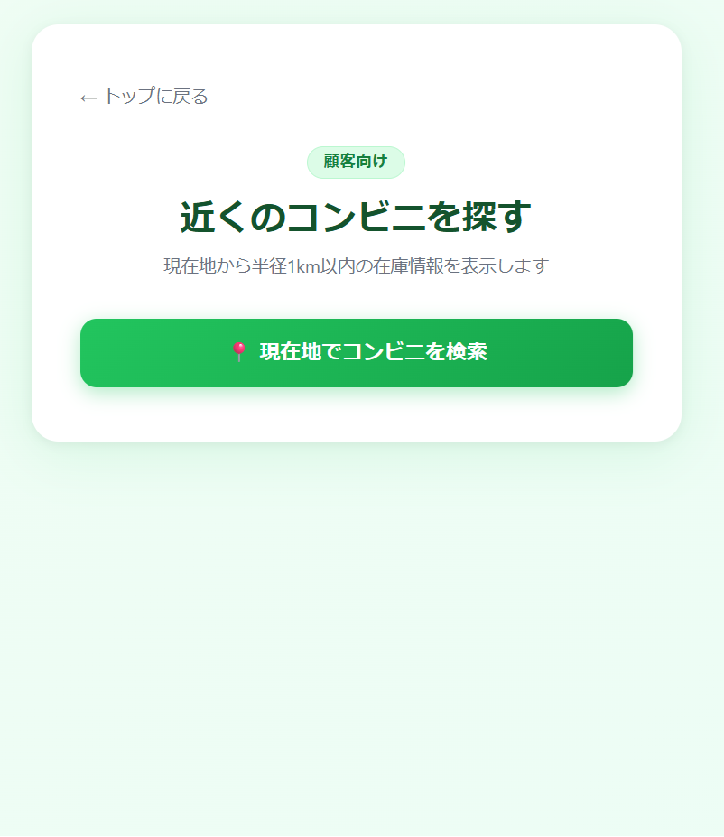
    </td>
    <td align="center">
      <b>店舗検索結果</b><br>
      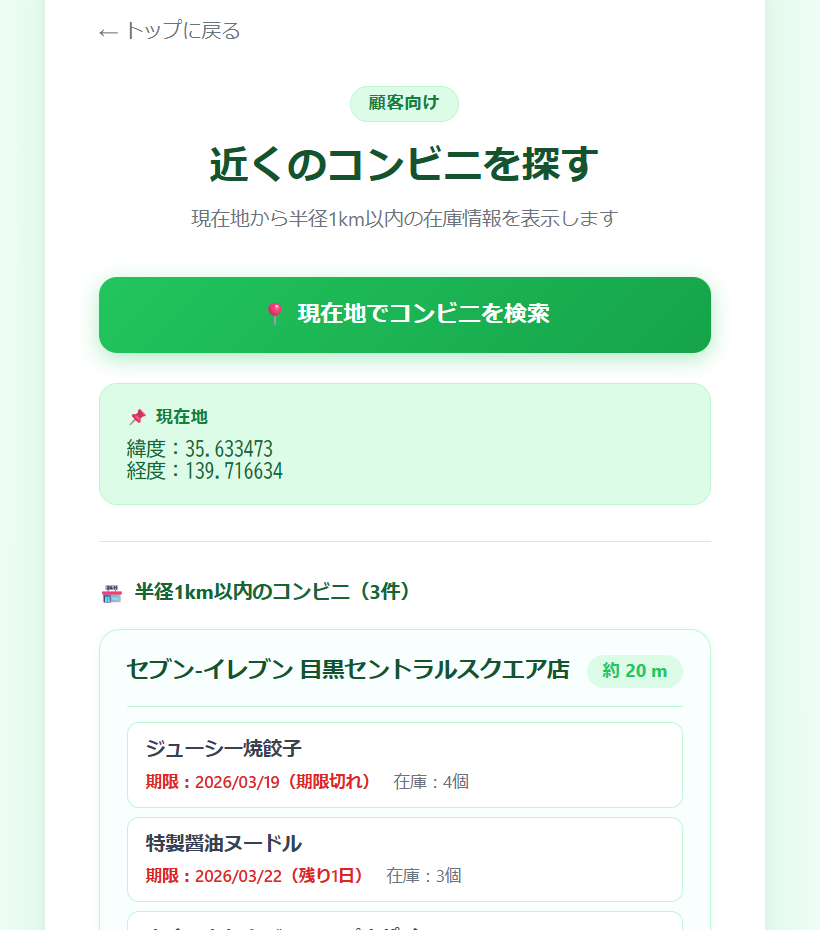
    </td>
  </tr>
  <tr>
    <td align="center">
      <b>期限間近商品の表示</b><br>
      
    </td>
    <td align="center">
      <b>Discord通知画面</b><br>
      
    </td>
    <td></td> </tr>

  <tr>
    <th colspan="3" align="center" style="font-size: 1.2em;">機能③ 売上データ分析・新商品提案</th>
  </tr>
  <tr>
    <td align="center">
      <b>分析結果①</b><br>
      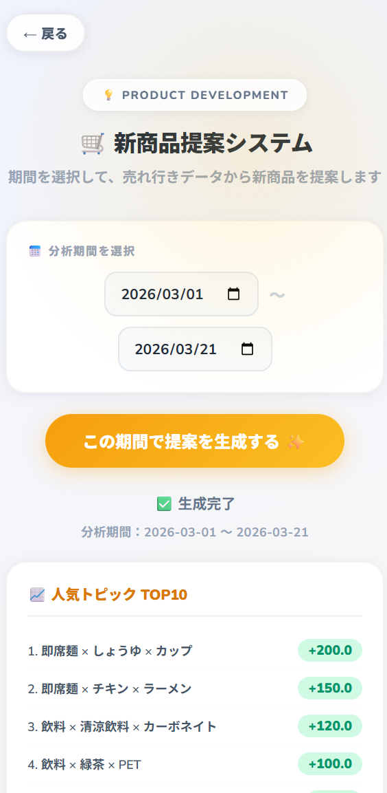
    </td>
    <td align="center">
      <b>分析結果②</b><br>
      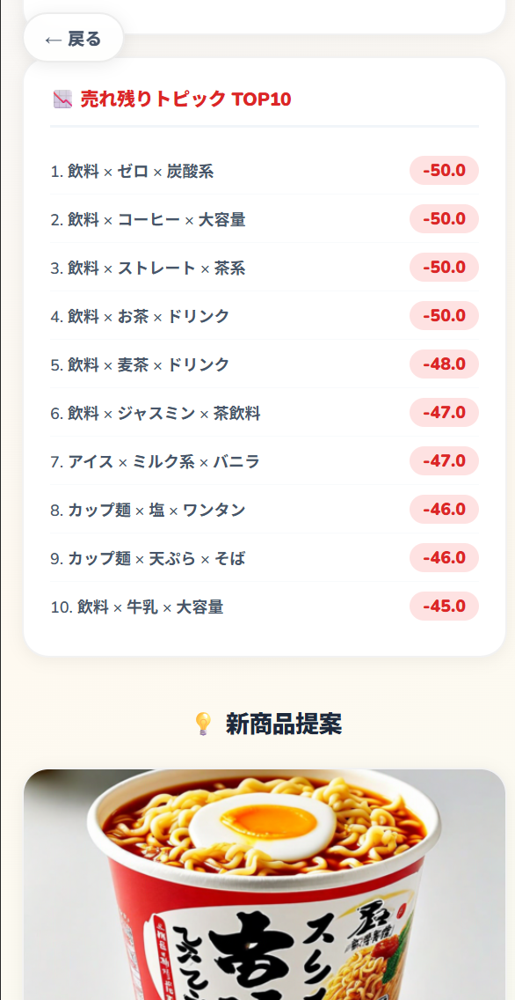
    </td>
    <td align="center">
      <b>新商品提案</b><br>
      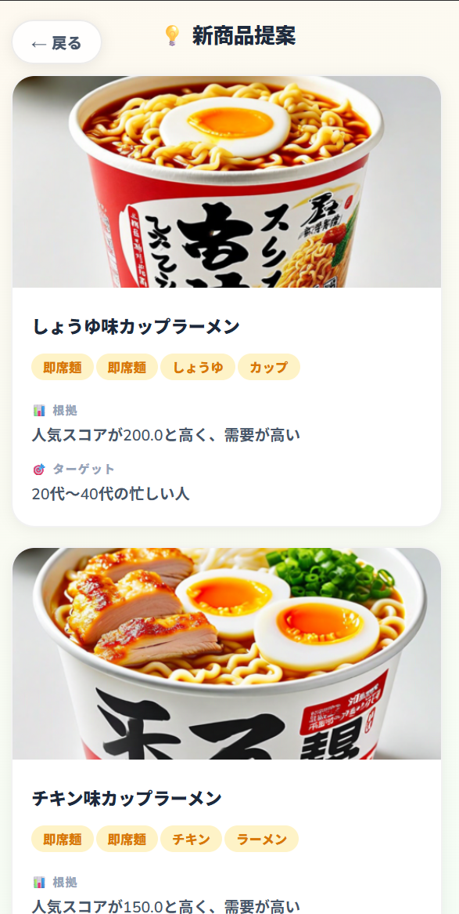
    </td>
     <td align="center">
      <b>新商品提案（変なもの）</b><br>
      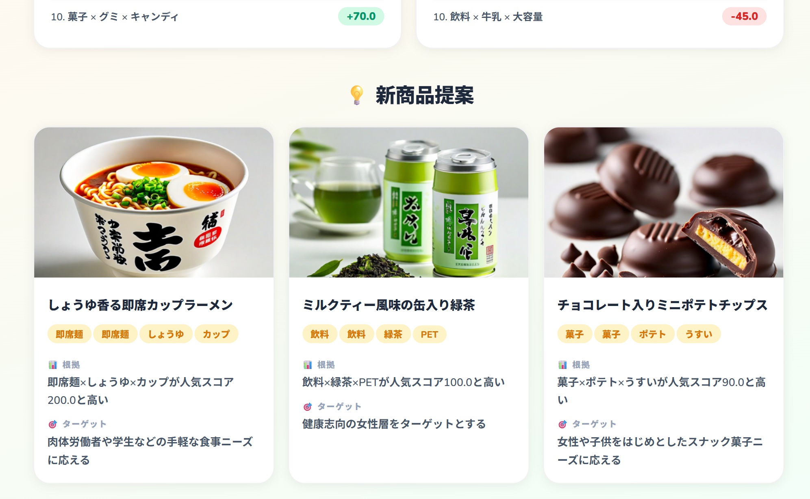
    </td>
  </tr>
</table>


## 機能概要

| 機能 | 内容 | 主なAWSサービス |
|---|---|---|
| 機能① | SNSバズ検知・在庫増加提案 | EventBridge, Lambda, Bedrock, DynamoDB, SNS |
| 機能② | 店舗在庫管理・賞味期限切れ通知 | API Gateway, Lambda, S3, Bedrock, DynamoDB, EventBridge, Discord |
| 機能③ | 売上データ分析・新商品提案 | S3, Glue, Athena, Bedrock |

---
## アーキテクチャ

<p align="center">
  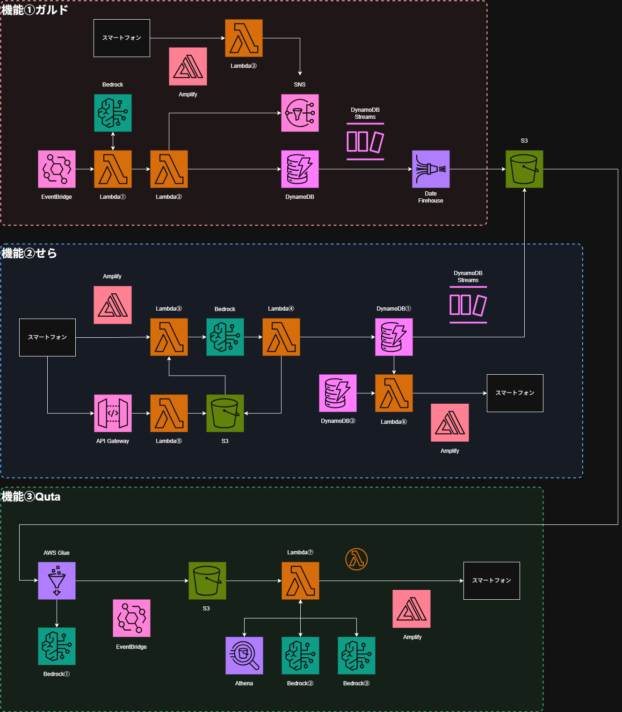
</p>

---
## 機能① SNSバズ検知・在庫増加提案

SNS上のトレンドをリアルタイムで検知し、売れ筋商品の在庫増加をスタッフに提案する。

### 処理フロー
```
EventBridge（定期実行）
  → collect_sns_data Lambda：SNSデータ収集・S3保存
  → calculate_buzz Lambda：Bedrockでバズスコア算出
  → stream_processor Lambda：DynamoDB更新・SNS通知
```

### 主要ファイル
```
feature1/
├── lambda_handlers/
│   ├── collect_sns_data.py   # SNSデータ収集
│   ├── calculate_buzz.py     # バズスコア算出
│   └── stream_processor.py  # DynamoDB更新・通知
└── template.yaml             # SAMテンプレート
```

---

## 機能② 店舗在庫管理・賞味期限切れ通知

### スタッフ側フロー
```
商品画像アップロード（最大3枚）
  → S3保存（Pre-signed URL）＋ Bedrock AI分析（並行実行）
  → 商品名・賞味期限をAIが自動抽出 → スタッフが確認・編集
  → DynamoDB（function_2テーブル）に登録
```

### 顧客側フロー
```
「近くのコンビニを探す」ボタン
  → Geolocation APIで現在地取得（1回のみ）
  → API Gateway → Lambda：Haversine公式で半径1km以内の店舗を特定
  → DynamoDBから期限間近の商品を抽出 → カード形式で表示
```

### 通知フロー
```
EventBridge（毎朝定刻）→ notify_expiration Lambda
  → DynamoDBをスキャンし期限3日以内の商品をDiscord通知
```

### DynamoDBテーブル

**`function_2`（在庫管理）**

| 属性名 | 型 | 説明 |
|---|---|---|
| `SSID` | Number (PK) | セッションID |
| `product_name` | String | 商品名 |
| `expiration_date` | String | 消費期限（YYYY/MM/DD） |
| `stock_quantity` | Number | 在庫数 |
| `StoreID` | String | 店舗ID |

**`Stores`（店舗情報）**

| 属性名 | 型 | 説明 |
|---|---|---|
| `StoreID` | String (PK) | 店舗ID |
| `StoreName` | String | 店舗名 |
| `Lat` / `Lng` | Number | 緯度・経度 |

### Lambda関数

| 関数名 | トリガー | 役割 |
|---|---|---|
| `give_URL.py` | API Gateway POST `/upload` | S3 Pre-signed URL発行 |
| `pass_to_bedrock.py` | Lambda Function URL | 画像AI分析・DynamoDB保存 |
| `search_nearby_stores.py` | API Gateway POST `/search` | 近隣店舗・期限商品検索 |
| `notify_expiration.py` | EventBridge（定期） | Discord期限切れ通知 |

---

## 機能③ 売上データ分析・新商品提案

仕入れ予測と過去の在庫データをGlueで整形し、Athenaで集計・分析し、その結果からBedrockが新商品を提案する。

### 処理フロー
```
S3（仕入れ・在庫データ）→ Glue（整形・Bedrockによるキーワード抽出）
  →Lambda（ Athena（SQLクエリ）→ Bedrock（新商品提案・画像生成) )→ Amplify
```
### S3
### function1から
| 属性名 | 型 | 説明 |
| :--- | :--- | :--- |
| **product_name** | String | 商品名 |
| **genre** | String | 商品のカテゴリ（ジャンル） |
| **stock_delta** | Number | 在庫の増減数 |

### function2から
属性名 | 型 | 説明 |
| :--- | :--- | :--- |
| **SSID** | Number | セッションID（Primary Key）  |
| **product_name** | String | 商品名（例: アメリカンドッグ）  |
| **category** | String | 商品のカテゴリ（ジャンル）  |
| **expiration_date**| String | 消費期限（形式: `YYYY/MM/DD`）  |
| **stock_quantity** | Number | 現在の在庫数  |
| **StoreID** | String | 店舗識別ID  |
| **confidence_score**| Number | AIによる分析の信頼度（0.0〜1.0）  |
| **created_at** | String | データ登録日時 |

```
この二つの表のデータを統一的に扱えるようにGlueで整形する。
加えて、新商品提案に向けて、Bedrock（Claude）で商品名とジャンルからキーワードを2つ抽出させる。
```
### 整形後のデータ
| 属性名 | 型 | 説明 |
| :--- | :--- | :--- |
| **genre** | String | 商品のカテゴリ（ジャンル） |
| **keyword_1** | String | 検索・分類用の関連キーワード1 |
| **keyword_2** | String | 検索・分類用の関連キーワード2 |
| **avg_restock** | Number | 期間内における平均補充（入荷）数 |
| **avg_leftover** | Number | 期間内における平均売れ残り（在庫残り）数 |
| **popularity_score** | Number | AIによる需要予測や注目度を示すスコア |

```
キーワードとスコアの関係をAthenaで集計し、その結果をBedrock（Claude）で分析してもらう。
その分析結果のテキストからBedrock（Nova）が画像を生成する。
その分析結果や生成画像などをGituhubとリンクしたAmplifyを使用して公開する。
```
### 主要ファイル
```
src/
├── inventory-traing-job.py  # Glueジョブ：整形・キーワード抽出・人気度算出
├── athena.sql               # 人気スコア集計テストクエリ
└── lambda_function.py       # Athena実行, Bedrockの結果分析・画像生成
```

---

## フロントエンド

```
frontend/src/pages/
├── TopPage.jsx                # トップ（店員 / 顧客 / 商品開発者 / 在庫管理担当者）
├── StaffPage.jsx              # 店員：画像アップロード・AI分析・在庫登録
├── CustomerPage.jsx           # 顧客：近隣コンビニ・期限間近商品の表示
└── ProductDevelopmentPage.jsx # 商品開発側（機能③フロントエンド）
(在庫管理担当者用のページはTopPage.jsxにリンクを貼っている)

```
